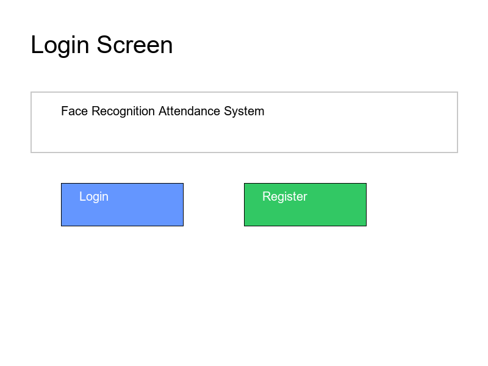
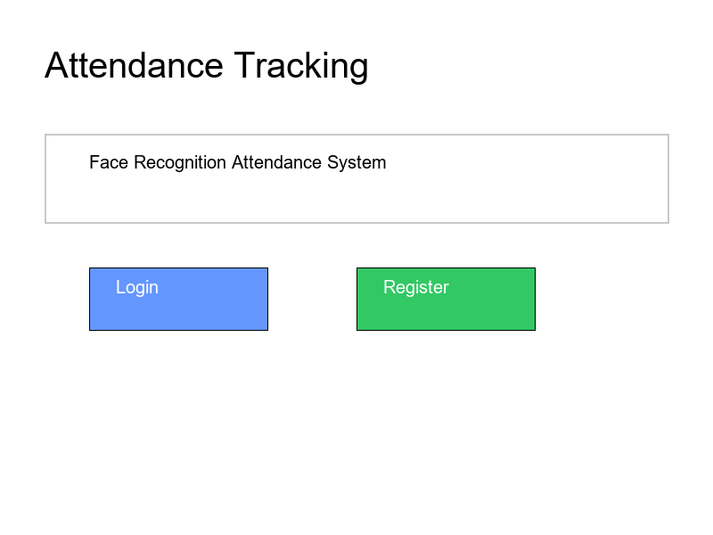

# Face Recognition Attendance System

## Overview
This is an advanced face recognition attendance application with a graphical user interface built using Tkinter and OpenCV. The system allows user registration and automated attendance tracking.

## Features
- Dynamic camera selection
- Face recognition with improved accuracy
- User registration with face encoding
- Detailed logging (system events and attendance)
- Error handling and user-friendly interface
- Eye blink anti-spoofing mechanism

## 🚀 Quick Start

### Prerequisites
- Python 3.8+
- Webcam
- Dependencies in `requirements.txt`

### Installation
```bash
# Clone the repository
git clone https://github.com/yourusername/face-rec-attendance.git
cd face-rec-attendance

# Create virtual environment
python -m venv venv
source venv/bin/activate  # On Windows: venv\Scripts\activate

# Install dependencies
pip install -r requirements.txt

# Download facial landmark predictor
python download_landmarks.py

# Run demo setup
python demo_setup.py

# Launch the application
python facemain.py
```

## 🎬 Demo Overview

### Demo Features
- Pre-configured demo users
- Simulated face recognition
- Eye blink anti-spoofing mechanism
- Walkthrough of key features

### How to Use the Demo
1. Run `demo_setup.py` to create demo profiles
2. Launch the application
3. Try registering and logging in with demo users
4. Observe eye blink verification during login

## 📸 Screenshots
### Screenshots






## 🛠 Technical Details
- Face Recognition: Using Dlib's face_recognition
- Anti-Spoofing: Eye blink detection
- GUI: Tkinter
- Video Capture: OpenCV

## 🔒 Security
- Local face encoding storage
- No cloud data transmission
- Eye blink verification
- Minimal personal information retention

## 🔒 Anti-Spoofing Features
- **Eye Blink Verification**: Prevents unauthorized access using static images
- Requires user to blink during login process
- Configurable blink detection parameters
- Logs potential spoofing attempts

## 🤝 Contributing
1. Fork the repository
2. Create a feature branch
3. Commit changes
4. Push to branch
5. Create Pull Request

## 📄 License
MIT License

## 📞 Contact
[yaswanthsaipodapati@gmail.com](mailto:yaswanthsaipodapati@gmail.com)

## Logging
- System events are logged in `attendance.log`
- Attendance records are saved in `Attendance.csv`

## Configuration
- Adjust face recognition tolerance in `util.py`
- Modify camera index if needed in `facemain.py`

## Troubleshooting
- Ensure camera is connected
- Check console for detailed error messages
- Verify face is well-lit and clearly visible
